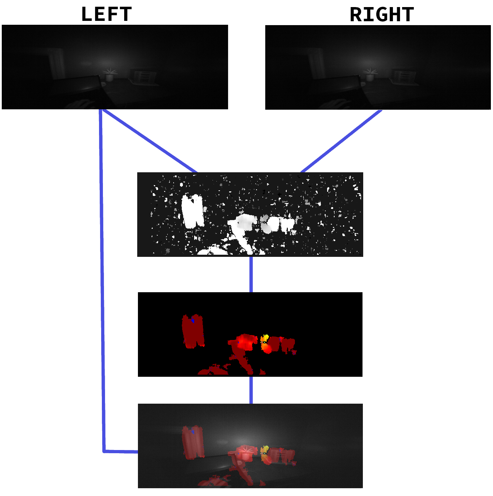
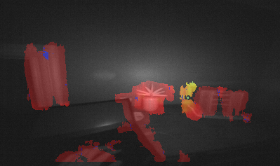
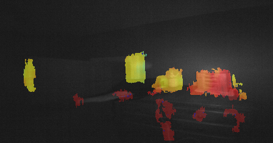
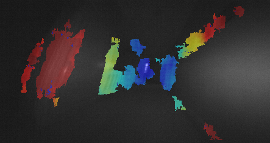

# OpenDepthMap

OpenDepthMap is an experiment in [Binocular Depth Mapping](https://en.wikipedia.org/wiki/Binocular_disparity), based around the [ultraleap](https://www.ultraleap.com/)'s first generation [LeapMotion](https://www.ultraleap.com/product/leap-motion-controller/) hand tracking sensors.

While the LeapMotion devices are designed only to provide real-time skeletal modeling and pose estimation of the human hand, they also expose their raw camera data as part of a debugging tool. OpenDepthMap makes use of this data to feed a *computer vision pipeline* and a *block matching stereo correspondence algorithm* in order to estimate depth data for an entire 3D space.

## The Tech

OpenDepthMap is split into three parts, across four distinct programming languages. From the highest level, the flow of data is as follows:

```
LeapMotion Driver <---> LeapMotion Library <---> FFI Wrapper <---> Rust Interface Library <---> CV Pipeline
```

The LeapMotion devices can only interact with Linux hosts via the [`LeapMotion V2`]() API. This API is written in C++ and has no C bindings, making it hard to expose via Foreign Function Interface to another language. I solved this problem by writing a [small wrapper]() that exposes the C++ functions I need via a C interface. A Rust library ([`libodm`]()) then uses this wrapper to expose a type-safe, memory-safe, and error-handled interface to the LeapMotion device in a format that is easy to generate further FFI bindings from. 

Originally, this project ended at Rust, and made use of the [`opencv`]() crate to handle the computer vision pipeline, but I was limited by a few critical functions missing from that binding, so I decided to add yet another layer of FFI into the mix. Using [PYO3](), `libodm` is exposed as a Python3 library, where the end-application uses it to control and read from the LeapMotion device, while also using Python's OpenCV bindings and [`numpy`]() for the final processing step.

## Vision Pipeline

The LeapMotion devices are dual-sensor infra-red cameras. Through the Image API, OpenDepthMap pulls both sensor outputs at the same time, and applies the following:

 1. A 3x3 blur
 2. A block matching stereo correspondence algorithm ([StereoBM](https://docs.opencv.org/3.4/d9/dba/classcv_1_1StereoBM.html))
 3. Contrast boost
 4. GrayScale pixel threshold
 5. Contour detection
 6. Contour filtering
 7. A mask based on only the largest contour
 8. Colour mapping
 9. Exposure boost
 10. Weighted image combination



The result is a raw camera view with depth data overlayed on top of it.

| Example Images  |
| -- | -- |
|  |  |
|  | |

 <!-- ---
Point cloud streams from Leap Motion cameras
```
clang libclang-dev libopencv-dev python3-dev python-dev python3-opencv

```

https://developer-archive.leapmotion.com/documentation/v2/cpp/index.html -->